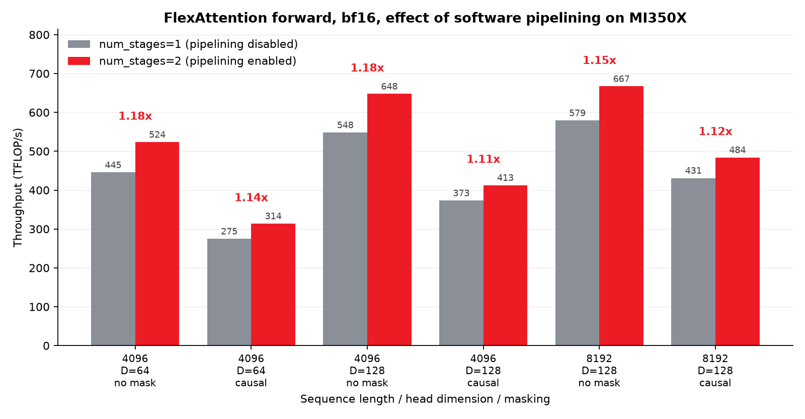
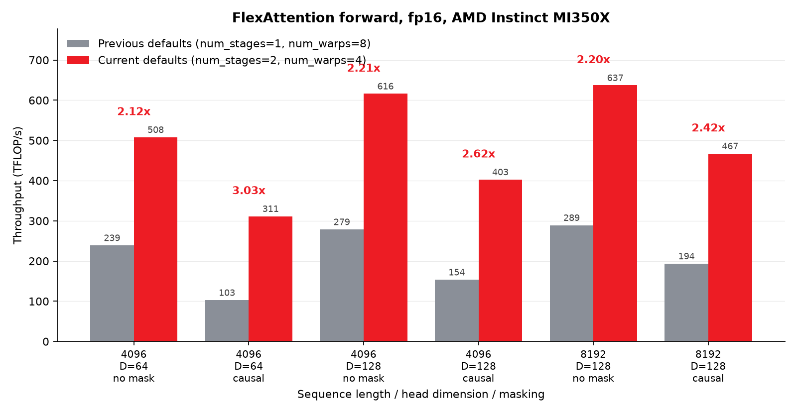

# Tuning PyTorch FlexAttention for AMD Instinct MI350X

PyTorch's [FlexAttention](https://pytorch.org/blog/flexattention/) lets you express attention
variants — causal masks, sliding windows, ALiBi, soft-capping — as small Python functions and have
`torch.compile` fuse them into a single Triton kernel. You get the flexibility of writing attention
in PyTorch with performance close to a hand-written kernel, and no new HIP code to maintain. How
close you get depends heavily on the kernel configuration PyTorch Inductor picks, and without
autotuning that configuration comes from a per-architecture table of defaults.

In this blog, we show that those defaults were leaving a large amount of MI350X performance
unclaimed, and we walk through a series of changes to PyTorch Inductor and Triton that recover it.
The largest single change is one number: the fp16 wavefront count. On the shapes we measured,
correcting the ROCm defaults improves fp16 FlexAttention forward throughput by **2.1x to 3.0x**.
That figure is the two changes combined; bf16, which only needed the pipelining half, gains **1.11x
to 1.18x**. All of the changes described here are merged into PyTorch and Triton upstream, and
require no user-side code changes.

## How Inductor configures the FlexAttention kernel

When Inductor lowers `flex_attention`, it renders a Triton template and fills in a configuration:
the query tile height `BLOCK_M`, the key/value tile width `BLOCK_N`, the software-pipelining depth
`num_stages`, and the number of wavefronts that cooperate on each tile, `num_warps`. Under
`torch.compile(mode="max-autotune")` these are benchmarked and the best is selected. Without
autotuning — the common case, and the default — Inductor takes a single configuration from a lookup
table keyed by architecture, data type, and head dimension.

On CDNA these defaults matter a great deal, because `num_warps` interacts directly with the matrix
cores. The MFMA instructions the FlexAttention template uses on CDNA4 produce a 32x32 output tile
per wavefront, and the wavefront count decides how Triton spreads those tiles over the work. Get it
wrong and the instruction does not change — instead you can end up computing part of the attention
twice, or shuffling intermediate results through shared memory between the two matrix multiplies. We
take that apart below. Because it depends on the tile sizes and the matrix-core geometry of the
particular part, the best value can differ from one architecture to the next, which is why these
defaults are now maintained per architecture.

## Enabling software pipelining

Triton's software pipeliner overlaps the global loads for the next key/value block with the math on
the current one. The ROCm FlexAttention defaults were pinned at `num_stages=1`, which disables that
overlap entirely, leaving the matrix cores idle while each tile is fetched.

Raising the default to 2 ([pytorch#176676](https://github.com/pytorch/pytorch/pull/176676)) recovers
a consistent double-digit gain. Measured on MI350X in bf16, forward pass only:



Effect of software pipelining (`num_stages` 1 to 2) on bf16 FlexAttention forward throughput.

| Sequence length | Head dim | Mask | `num_stages=1` | `num_stages=2` | Speedup |
|---|---|---|---|---|---|
| 4096 | 64 | none | 445.4 | 523.6 | 1.18x |
| 4096 | 64 | causal | 274.6 | 313.9 | 1.14x |
| 4096 | 128 | none | 548.2 | 647.6 | 1.18x |
| 4096 | 128 | causal | 373.0 | 412.7 | 1.11x |
| 8192 | 128 | none | 579.1 | 667.1 | 1.15x |
| 8192 | 128 | causal | 431.0 | 484.1 | 1.12x |

Throughput in TFLOP/s; higher is better. The upstream review of this change swept 16 shapes with
[attention-gym](https://github.com/meta-pytorch/attention-gym) and reported a geometric mean of
1.13x, which sits inside the 1.11x to 1.18x range above. If you want to check a broader set of
shapes than we show here, attention-gym is the quickest way to do it.

## Correcting the fp16 wavefront count

The larger gain came from the fp16 entries, which used `num_warps=8` at head dimensions 64 and 128
while bf16 used 4 for the same shapes. On gfx950, 4 turns out to be the better choice at both head
dimensions, and the difference is substantial.

Correcting the fp16 default to 4 ([pytorch#180720](https://github.com/pytorch/pytorch/pull/180720))
changes a single value, with an outsized effect:

| Sequence length | Head dim | Mask | `num_warps=8` | `num_warps=4` | Speedup |
|---|---|---|---|---|---|
| 4096 | 64 | none | 233.9 | 508.0 | 2.17x |
| 4096 | 64 | causal | 119.1 | 311.4 | 2.61x |
| 4096 | 128 | none | 331.2 | 616.2 | 1.86x |
| 4096 | 128 | causal | 187.0 | 402.7 | 2.15x |
| 8192 | 128 | none | 337.7 | 637.2 | 1.89x |
| 8192 | 128 | causal | 225.5 | 467.4 | 2.07x |

Measured with `num_stages=2` in both columns, so this isolates the wavefront count alone. Our sweep
holds batch size at 1; the table in [pytorch#180720](https://github.com/pytorch/pytorch/pull/180720)
covers batch 32 down to 1 at matching token counts and reports 1.61x to 2.03x throughout, so the
effect is not an artifact of batch size.

### Why eight was the wrong number

The cause is visible in the generated IR, and it is not that the matrix core does anything smaller.
Compiling the fp16 head-dimension-128 kernel both ways, the two configurations issue the same
instruction, `v_mfma_f32_32x32x16_f16`, producing a 32x32 output tile per wavefront. What changes is
how Triton spreads wavefronts across the kernel's two dot products.

Triton's AMD backend has a rule for exactly this pattern, in `planWarps`
([AccelerateAMDMatmul.cpp](https://github.com/triton-lang/triton/blob/main/third_party/amd/lib/TritonAMDGPUTransforms/AccelerateAMDMatmul.cpp)).
When one dot feeds the next — QK^T into P@V, the flash-attention shape — the *first* dot always gets
`warpsPerCTA = {num_warps, 1}`. That is deliberate, and the comment says why: putting every
wavefront on the M axis keeps each softmax row inside one wavefront, avoiding a cross-wavefront
reduction, and it is meant to let the second dot reuse the same layout. The *second* dot then caps
its M axis at `BLOCK_M / 32` — it will not spread more wavefronts down M than there are MFMA tiles —
and puts whatever is left on the N axis.

Those two rules only agree while `num_warps` is at most `BLOCK_M / 32`. At `BLOCK_M=128` that
ceiling is four. Ask for eight and they diverge, and the kernel pays twice over. QK^T spreads eight
wavefronts across a tile that four already cover, so the M dimension is covered twice and that dot
is computed redundantly. Meanwhile the second dot picks `[4, 2]`, so the layout conversion that the
first rule exists to prevent happens anyway — and on AMD that conversion round-trips through LDS.

Both costs are countable in the assembly. Weighting static MFMA instructions by the wavefronts that
execute them, `num_warps=8` issues 768 wave-MFMAs against 512 for `num_warps=4`; with `BLOCK_M=128`,
`BLOCK_N=64` and head dimension 128 the two dots cost the same, so that 1.5x is precisely the price
of computing one of them twice. The conversion shows up as 138 `ds_write` instructions against 9.

That model makes a falsifiable prediction — stay at or below the ceiling and both costs vanish
regardless of tile size — so we compiled five combinations and read the layouts back:

| `BLOCK_M` | `num_warps` | ceiling (`BLOCK_M / 32`) | layouts emitted | `ds_write` |
|---|---|---|---|---|
| 128 | 4 | 4 | `[4, 1]` | 9 |
| 128 | 2 | 4 | `[2, 1]` | 17 |
| 64 | 2 | 2 | `[2, 1]` | 9 |
| 128 | 8 | 4 | `[8, 1]` and `[4, 2]` | 138 |
| 64 | 8 | 2 | `[8, 1]` and `[2, 4]` | 136 |

So the actionable rule on CDNA4 is simply `num_warps <= BLOCK_M / 32`, with equality to keep every
wavefront busy. For `BLOCK_M=128` that is 4, which is exactly the value that landed.

Two things this does not settle. The wider fix belongs in `planWarps` rather than in each kernel's
config table, since the tail-dot cap is what breaks the head-dot rule's own goal — but we have not
written that patch or measured it. And by this model MI300X's `BLOCK_M=64` with eight wavefronts, in
the table below, sits on the wrong side of the same ceiling, yet it is the tuned default there. We
have no MI300X to compile on, so we cannot say whether the same costs appear or are simply
outweighed. It is a promising thing for someone with that hardware to check.

### What did not change

If you run FlexAttention in fp16 on MI350X, this arrives with a PyTorch update and there is nothing
to switch on. The part worth dwelling on is what did *not* change, and it is worth being precise
about the level. Dump what Inductor emits for both configurations and the kernel body is identical;
the only difference is the `num_warps` value it is compiled and launched with. Everything below that
line is where the difference appears — as we just saw, the layouts and scheduling Triton derives
from that one value are substantially different. Nothing about the attention algorithm had to be
rewritten to get this throughput. If you are tuning your own attention workload, that is the
encouraging read: the same lever is exposed to you through `kernel_options` and `max-autotune`, and
on CDNA it is worth pulling before you conclude you need to hand-write a kernel.

For a sense of the absolute level this reaches, the upstream review of the change reported the
corrected configuration landing on par with an optimized standalone Flash Attention kernel. We did
not reproduce that comparison here; the PR has the details.

## One default table per architecture

Once it was clear that gfx950 wanted different settings, the natural next step was to give each CDNA
generation its own entry. MI300X (gfx942) and MI350X (gfx950) differ in ways that can move the
optimum — LDS capacity per compute unit is 64 KB against 160 KB, and fp16 matrix throughput differs
— though we did not attribute the tuning outcome to either specifically.

[pytorch#181283](https://github.com/pytorch/pytorch/pull/181283) splits the single ROCm table into
per-architecture tables selected by device capability, falling back to a conservative configuration
for targets without an entry. The full set of forward defaults, as `(BLOCK_M, BLOCK_N, num_stages,
num_warps)`:

| Data type | Head dim | MI300X (gfx942) | MI350X (gfx950) |
|---|---|---|---|
| bf16 | 64, 128 | 64, 64, 2, 8 | 128, 64, 2, 4 |
| bf16 | 256 | 32, 64, 2, 8 | 32, 64, 2, 4 |
| fp16 | 64, 128 | 64, 32, 1, 8 | 128, 64, 2, 4 |
| fp16 | 256 | 32, 32, 1, 8 | 32, 64, 2, 4 |
| fp32 | 64, 128 | 128, 32, 1, 4 | 128, 32, 1, 4 |
| fp32 | 256 | 64, 16, 1, 4 | 64, 16, 1, 4 |

MI300X prefers smaller tiles spread across more wavefronts; MI350X prefers larger tiles with fewer.
The practical benefit of the split is that MI300X now carries its own validated entry rather than
inheriting values tuned for a different part, and either architecture can be re-tuned later without
regressing the other. If you are bringing up a new target, this table is where its entry belongs.
The gfx950 values are unchanged by the split, so the numbers in this post are unaffected by it.

One asymmetry is worth calling out, since it cuts against the pipelining section above: fp32 keeps
`num_stages=1` on both architectures. fp32 was outside what we measured here — the work described in
this post targeted the half-precision paths — so those entries were left alone rather than shown not
to benefit. If you run fp32 attention on either part, `kernel_options` makes that cheap to check for
your own shapes.

## Reducing addressing overhead

Attention kernels spend a meaningful part of their instruction budget on address arithmetic rather
than math. Triton emits 64-bit pointer arithmetic by default, but when a tensor is small enough that
every offset fits in 32 bits, the wider arithmetic is pure overhead and blocks the AMD backend from
using its cheaper buffer load and store instructions.

[pytorch#176675](https://github.com/pytorch/pytorch/pull/176675) makes Inductor emit
`tt.pointer_range=32` on HIP for tensor arguments whose storage provably fits within 2 GB. On
Inductor's pointwise path the annotation is suppressed for kernels that use atomics, since buffer
operations do not support them, and it can be turned off with
`TORCHINDUCTOR_EMIT_POINTER_RANGE_32=0`.

[pytorch#178541](https://github.com/pytorch/pytorch/pull/178541) is the necessary follow-up.
User-defined Triton kernels receive pointers whose bounds Inductor cannot reason about, so the
annotation must be suppressed for them rather than assumed safe.

### A gap in those two controls

Worth knowing if you rely on either one: both are applied in `TritonKernel.codegen_kernel()`, which
template kernels do not go through. `TritonTemplateKernel.jit_lines()` builds its own metadata and
calls `config_of()` without the override, so today neither the environment flag nor the atomics
suppression reaches the FlexAttention kernel itself — setting the flag to `0` leaves the template
kernel fully annotated. It is benign on gfx950, where the backend lowers the atomic case to a real
`buffer_atomic_add_f32`, but the escape hatch does not currently cover the kernel this post is
about. Gating `config_of()` in `jit_lines()` the way `codegen_kernel()` does would close it.

## Compiler support in Triton

The addressing work above only pays off if Triton's AMD backend can use buffer operations — loads
addressed by a scalar base plus a vector of offsets, which are cheaper than fully general pointer
loads. Widening where those apply, and keeping register pressure down, took a handful of changes in
Triton itself. None of them is a headline speedup on its own, and the speedup *ratios* above are
unaffected by them, since both columns of every table are compiled with buffer ops enabled. The
absolute throughput is a different matter: force the flex kernel back onto general global loads and
the causal fp16 figure at head dimension 128 drops by about a quarter, so the buffer-op path is
worth roughly 1.33x there. These are also what makes that path available to any Triton kernel on
AMD, not just this one:

* [triton#9619](https://github.com/triton-lang/triton/pull/9619) enables buffer operations in
  `ConvertToBufferOps` for 64-bit offsets, widening the set of kernels that can benefit.
* [triton#9912](https://github.com/triton-lang/triton/pull/9912) fixes an SSA dominance violation
  that the above exposed.
* [triton#10592](https://github.com/triton-lang/triton/pull/10592) packs `fp32` to `bf16`
  round-to-zero conversions using `v_perm_b32`, relieving VGPR pressure. Registers govern occupancy
  on CDNA: fewer per wavefront means more wavefronts resident and more latency hidden.
* [triton#8935](https://github.com/triton-lang/triton/pull/8935) adds a driver check for
  cooperative-groups support, and
  [triton#8847](https://github.com/triton-lang/triton/pull/8847) corrects architecture selection in
  a `num_ctas` test.

## Performance evaluation

Taken together, the pipelining and wavefront-count corrections improve fp16 FlexAttention forward
throughput on MI350X by 2.1x to 3.0x relative to the previous ROCm defaults:



Combined effect of the corrected defaults (`num_stages` 1 to 2 and `num_warps` 8 to 4) on fp16
FlexAttention forward throughput.

| Sequence length | Head dim | Mask | Previous defaults | Current defaults | Speedup |
|---|---|---|---|---|---|
| 4096 | 64 | none | 239.1 | 508.0 | 2.12x |
| 4096 | 64 | causal | 102.7 | 311.4 | 3.03x |
| 4096 | 128 | none | 278.7 | 616.2 | 2.21x |
| 4096 | 128 | causal | 153.5 | 402.7 | 2.62x |
| 8192 | 128 | none | 289.1 | 637.2 | 2.20x |
| 8192 | 128 | causal | 193.5 | 467.4 | 2.42x |

Our evaluation covers the following settings:

* GPU: one AMD Instinct MI350X (gfx950)
* Batch size: 1
* Attention heads: 16 at sequence length 4096, 32 at sequence length 8192
* Sequence length: 4096 and 8192
* Head dimension: 64 and 128
* Masking: none and causal, via `create_block_mask`
* Data type: fp16 and bf16, forward pass only
* Software: ROCm 7.2.1, PyTorch 2.14.0a0+gitb5460ee, Triton 3.8.0

Throughput is reported in TFLOP/s, counting `4 * B * H * D * V` floating-point operations, where `V`
is the number of live entries in the score matrix: `S * S` with no mask, or `(S * S + S) / 2` under
a causal one. Since the causal rows are normalized by that smaller count, they are not directly
comparable with the unmasked rows.

### Benchmark methodology

Previous configurations are reproduced on the current build by pinning `BLOCK_M`, `BLOCK_N`,
`num_stages`, and `num_warps` through `kernel_options`, rather than by checking out older commits.
This isolates the effect of the configuration change from everything else that moved upstream in the
same period.

If you benchmark attention on this hardware yourself, two things will bite you. They cost us a first
set of numbers before we caught them, so they are worth passing on. MI350X idles at roughly 145 MHz
SCLK, which means a short warmup measures a GPU that never reached boost clocks. And on a shared
machine, another process on the same device can cost several times the kernel's runtime on
individual points, which is easy to mistake for a real result.

Both are cheap to defend against. Every measurement here ramps clocks with several seconds of dense
matrix multiplication before timing, runs pinned to a device verified idle via
`HIP_VISIBLE_DEVICES`, and takes `triton.testing.do_bench` medians with a 200 ms warmup and 500 ms
of repetitions, three times per point and reduced by median. The reported figures are the median
across three independent process-level runs, where the median run-to-run spread is 0.5% and the
worst case 4.9% on a single bf16 point — enough to make the derived speedups stable to roughly +/-
0.02x.

Every timed configuration is also checked against an eager reference. The largest absolute
deviations were 2.0e-3 for fp16 and 1.6e-2 for bf16, which is what you should expect from a change
in accumulation order at these sequence lengths rather than a sign of a wrong result.

### Reproducing these results

The improved defaults need nothing beyond a PyTorch on ROCm recent enough to contain these changes,
all of which are merged upstream. There is no new API and no opt-in flag:

```python
import torch
from torch.nn.attention.flex_attention import create_block_mask, flex_attention

B, H, S, D = 1, 16, 4096, 128
q, k, v = (torch.randn(B, H, S, D, device="cuda", dtype=torch.float16) for _ in range(3))
# None, None: the mask_mod ignores b and h, so one mask serves every batch and head.
block_mask = create_block_mask(lambda b, h, q_idx, kv_idx: q_idx >= kv_idx, B, None, S, S,
                               device="cuda")

compiled = torch.compile(flex_attention, fullgraph=True)
out = compiled(q, k, v, block_mask=block_mask, scale=D**-0.5)
```

To measure the improvement, time that call against one with the previous defaults pinned. This
follows the protocol described above, which matters: without the clock ramp and the repeats, the
same code understates throughput by 12–18% on an idle-clocked GPU.

```python
import statistics
import triton

def ramp_clocks(seconds=8.0):
    """MI350X idles near 145 MHz; time nothing until it has reached boost clocks."""
    import time
    a = torch.randn(8192, 8192, device="cuda", dtype=torch.float16)
    b = torch.randn(8192, 8192, device="cuda", dtype=torch.float16)
    deadline = time.time() + seconds
    while time.time() < deadline:
        for _ in range(20):
            torch.mm(a, b)
        torch.cuda.synchronize()
    del a, b
    torch.cuda.empty_cache()

def bench(opts=None, reps=3):
    fn = torch.compile(
        lambda q, k, v: flex_attention(q, k, v, block_mask=block_mask, scale=D**-0.5,
                                       kernel_options=opts),
        fullgraph=True,
    )
    fn(q, k, v)
    torch.cuda.synchronize()
    ms = statistics.median(
        triton.testing.do_bench(lambda: fn(q, k, v), warmup=200, rep=500,
                                return_mode="median")
        for _ in range(reps)
    )
    valid = (S * S + S) / 2  # live score entries under a causal mask
    return 4 * B * H * D * valid / ms * 1e-9

ramp_clocks()
previous = {"BLOCK_M": 128, "BLOCK_N": 64, "num_stages": 1, "num_warps": 8}
print(f"previous defaults: {bench(previous):.1f} TFLOP/s")
print(f"current defaults : {bench():.1f} TFLOP/s")
```

Save the two snippets above as `bench_flex.py` and pin the run to an idle GPU, so that neither cold
clocks nor another tenant perturbs the result:

```bash
HIP_VISIBLE_DEVICES=0 python bench_flex.py
```

To search the configuration space for your own shapes instead of relying on the defaults:

```python
compiled = torch.compile(flex_attention, mode="max-autotune", fullgraph=True)
```

## Summary

In this blog, we traced a large FlexAttention performance gap on MI350X to its kernel configuration
defaults rather than to the generated code. Enabling software pipelining is worth 1.11x to 1.18x on
bf16, correcting the fp16 wavefront count from 8 to 4 is worth a further 1.86x to 2.61x, and the two
together improve fp16 forward throughput by 2.1x to 3.0x on the shapes measured. Splitting the ROCm
default table per architecture allows MI300X and MI350X to be tuned independently, and the
`tt.pointer_range=32` work with its supporting Triton changes reduces addressing overhead on HIP.

If there is one thing to take away beyond the numbers, it is that configuration defaults are worth
revisiting whenever a new architecture arrives. The largest improvement here needed no compiler work
at all — just one value that suited an earlier part better than the current one, found by measuring
one change at a time. That approach also surfaces things an aggregate hides: with `num_warps=8`
still in place, pipelining alone is very slightly negative on the unmasked fp16 head-dimension-64
shape (0.98x), even though it helps every other shape measured, including the causal case at the
same head dimension. Correct the warp count first, though, and pipelining is worth about 1.17x on
that same shape. The two knobs interact, which is a good reason to tune them together rather than
one at a time.

If you are running FlexAttention on AMD hardware and your shapes or data types differ from the ones
here, the defaults are a starting point rather than an answer. One rule transfers directly: on
CDNA4, keep `num_warps` at or below `BLOCK_M / 32`. Past that ceiling Triton's two warp-layout rules
disagree and the kernel pays for both redundant matrix-core work and a trip through LDS. Beyond
that, `mode="max-autotune"` will search the space for you, `kernel_options` will pin a configuration
once you have found a good one, and if you find defaults that beat ours on a given part, the
per-architecture table is now a straightforward place to contribute them.

There is more to do in three directions: the backward pass, whose configuration has received far
less attention than the forward; newer architectures, where that table gives validated defaults a
clean home; and `planWarps` itself, because a config table that has to steer around the compiler's
warp tiling is a workaround rather than a fix.
